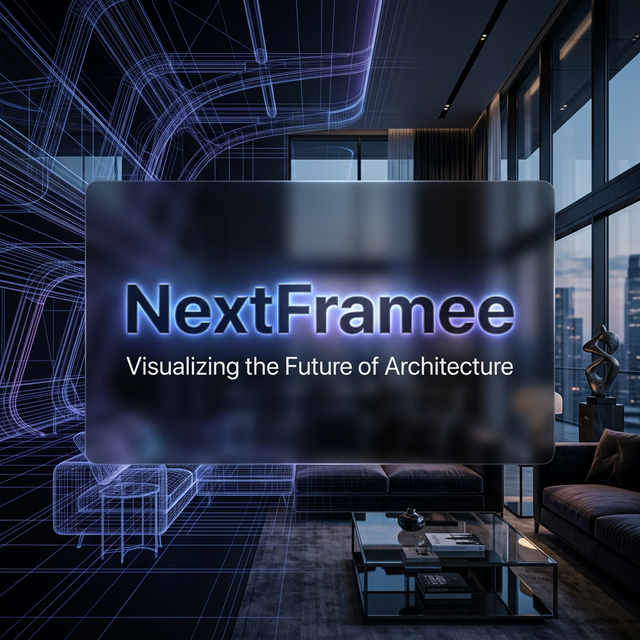

# NextFramee — Immersive VR & 3D Visualization Studio



**NextFramee** is a premium architectural visualization and VR studio based in India. This repository contains the source code for the NextFramee official marketing website, built with a heavy focus on ultra-smooth Apple-style animations, dark-mode glassmorphism aesthetics, and scroll-driven experiences.

## 🚀 Live Demo

[https://next-frame-3-d.vercel.app](https://next-frame-3-d.vercel.app)

## 🛠 Tech Stack

The platform is engineered using a modern, high-performance web stack:

- **Framework:** [Next.js 16](https://nextjs.org/) (App Router)
- **Library:** [React 19](https://react.dev/)
- **Styling:** [Tailwind CSS v4](https://tailwindcss.com/)
- **Animation Engine:** [Framer Motion](https://www.framer.com/motion/) (v12) for layout transitions, scroll spy, and complex interaction tracking.
- **Smooth Scrolling:** [Lenis](https://lenis.darkroom.engineering/) for buttery-smooth native scroll hijacking to make scroll-bound animations feel weightless.
- **Utilities:** `tailwind-merge` & `clsx` for dynamic tailwind class compilation.

## 🏗 Architecture & Core Features

The architecture is split into modular client components, each responsible for rendering highly interactive section blocks. 

### Key Components Built

1. **`HeroCanvas.tsx`**
   - Implements a stunning Apple-style pre-rendered image sequence animation.
   - Maps the user's scroll position directly to an HTML5 `<canvas>` array (loading 100+ high-res frames) without lag.
   - Utilizes a custom `useImagePreloader` hook to guarantee zero jank when scrolling.

2. **`ServicesSection.tsx`**
   - Interactive "Deck of Cards" mechanism.
   - On Desktop: Hovering over the deck triggers a `framer-motion` spring animation that expands all cards left and right simultaneously.
   - On Mobile: Cards automatically expand vertically into a scrollable reading list when the section enters the viewport.

3. **`Navbar.tsx`**
   - Frosted glass navigation bar.
   - Utilizes `IntersectionObserver` to detect which section of the page the user is currently reading, and automatically slides an animated underline across the active navigation link using Framer Motion's `layoutId`.

4. **`VRGlassesGlimpse.tsx` & `MetaglassesShowcase.tsx`**
   - High-fidelity product showcases for NextFramee's Metaframes and VR Glasses.
   - Leverages `useScroll` and `useTransform` to rotate floating products in 3D space based on how fast the user is scrolling down the page.

5. **`ContactForm.tsx` & `BookDemoCTA.tsx`**
   - A highly polished, ultra-premium contact experience.
   - Input labels beautifully float and glow conditionally, while the submit buttons feature custom sweep gradients.
   - Floating WhatsApp CTA is persistently injected universally via `layout.tsx` for immediate lead generation. Includes `tel:` links bound to the mobile native dialer app with responsive spacing.

### Animation Philosophy

- **Zero Layout Shifts:** Everything uses CSS transforms (`translate`, `scale`, `rotate`) powered by Framer Motion to prevent heavy DOM repaints.
- **Parallax Backgrounds:** Radial gradient background blobs are tied to the scroll offset to give the page an artificial depth.
- **Spring Physics:** All hover states and UI revelations use realistic stiffness and damping configurations rather than static linear transitions.

## 📦 Local Development

1. Clone the repository
2. Install dependencies:
   ```bash
   npm install
   ```
3. Run the development server:
   ```bash
   npm run dev
   ```
4. Open [http://localhost:3000](http://localhost:3000) with your browser to preview the site.

## 📱 Responsiveness

The entire interface possesses a highly customized responsive design. Heavy structural paddings (`py-32`) compress gracefully on mobile (`py-16`) to tighten the vertical scroll pace. Touch-based scroll mechanics completely replace complex hover-based desktop experiences without degrading performance.

---
*Created by the team at NextFramee Studio.*
